# cv04-calibration-to-depth

**From a lens to a number in metres.** This repository derives the pinhole
camera model, calibrates a camera against a *known* ground truth, recovers
two-view geometry from correspondences, matches a stereo pair from scratch, and
turns the result into depth — with every intermediate claim measured rather than
asserted.

It is the fourth and most advanced of four teaching repositories. The earlier
three cover images as arrays and classical filtering, features and matching, and
neural networks from scratch;
this one assumes you are comfortable with all of that and picks up where "I have
two images and some matched points" leaves off.

Everything runs on a laptop CPU — most examples in a second or two, the two that
render calibration boards in about twenty. **There is no camera and no
download**: every image in this repository is rendered by the code in it, from
intrinsics and poses that are variables in a script. That choice is the point,
and it is defended in [Why synthetic](#why-synthetic-and-what-it-costs) below.

```
python3 -m pip install -r requirements.txt
python3 -m pytest -q                      # 88 tests, ~14 s
python3 examples/01_pinhole_projection.py # ... through 10, each writes a figure
```

---

## What you will understand by the end

- Why `K` has exactly four numbers that matter, what each is in units you can
  picture, and why the fifth (skew) is always zero.
- Why homogeneous coordinates exist, and why **dividing by the last element is
  not bookkeeping — it is perspective**.
- Why `t` in `[R|t]` is not the camera's position, and what plotting it instead
  of `C = -Rᵀt` does to a trajectory.
- What radial and tangential distortion each do to a straight line, why the
  model is written forward and inverted numerically, and why undistortion is a
  lookup table rather than a computation.
- **Why a low reprojection error does not mean a correct calibration** — shown
  with two capture protocols whose reprojection errors are indistinguishable
  and one of which recovers a focal length 264% too large.
- What an epipolar line physically is, how to estimate `F` from eight points,
  and what Hartley normalisation is worth in measured pixels.
- Why rectification turns a 2-D search into a 1-D one, and the three ways stereo
  matching fails: **no information, too many answers, no answer at all**.
- Why `Z = fB/d` means depth error grows with the **square** of distance, and
  why that single fact governs every stereo system ever built.

---

## The flow

```
      known K, D, and board poses                    known 3-D scene
                  |                                         |
                  v                                         v
      +---------------------------+          +---------------------------+
      |  render checkerboards     |          |  render a stereo pair     |
      |  (backward ray trace      |          |  (planes + textures,      |
      |   through the lens model) |          |   exact per-pixel depth)  |
      +---------------------------+          +---------------------------+
                  |                                         |
     detect corners|                                        | (already rectified
                  v                                         |  by construction;
      +---------------------------+                         |  ex. 08 also does
      |  cv2.calibrateCamera      |                         |  a real rectify)
      |  -> K_hat, D_hat, poses   |                         |
      +---------------------------+                         |
                  |                                         |
    compare against the truth that                          |
    generated the images  (ex. 04, 05)                       |
                  |                                         v
                  |                            +---------------------------+
                  |                            |  cost volume  D x H x W   |
                  |                            |  windowed SAD / SSD       |
                  |                            +---------------------------+
                  |                                         |
                  |                              winner-take-all (argmin)
                  |                                         |
                  |                              parabolic sub-pixel fit
                  |                                         |
                  |                              left-right consistency
                  |                                         v
                  |                            +---------------------------+
                  |                            |  disparity map (NaN where |
                  |                            |  it has no answer)        |
                  |                            +---------------------------+
                  |                                         |
                  +--------------> Z = f*B / (d + doffs) <---+
                                             |
                                             v
                                    metres, with an error
                                    that grows as Z^2
```

Two-view geometry (examples 06 and 07) is the bridge between the two columns:
the homography is what makes calibration possible at all, and the fundamental
matrix is what makes a 1-D stereo search legitimate.

### Stage by stage

| # | Example | What it establishes |
|---|---------|---------------------|
| 1 | `01_pinhole_projection.py` | Similar triangles → `K`; the perspective divide; the real-vs-virtual image plane sign |
| 2 | `02_extrinsics_and_resolution.py` | `X_cam = R X + t`, `C = -Rᵀt`, and what a resize or a crop does to `K` |
| 3 | `03_distortion.py` | Brown-Conrady forward, the iterative inverse, and undistortion measured as residual bow |
| 4 | `04_calibrate_from_synthetic_views.py` | Calibration from rendered images, checked against the truth; the fronto-parallel confound |
| 5 | `05_reprojection_error.py` | What the residual is, what a good value looks like, and what its *structure* tells you |
| 6 | `06_homography_dlt.py` | The DLT by hand, against `cv2.findHomography`, and what normalisation buys |
| 7 | `07_eight_point_epipolar.py` | Epipolar lines, the eight-point algorithm, and `E`'s four candidate poses |
| 8 | `08_rectify_and_block_match.py` | Rectification measured, and a block matcher against `StereoBM`/`StereoSGBM` |
| 9 | `09_failure_modes.py` | Textureless, repeated and occluded, separated and quantified |
| 10 | `10_disparity_to_depth.py` | `Z = fB/d`, `doffs`, the `Z²` error law, `Q`, and triangulation as least squares |

---

## Figures

All twelve are produced by the examples above; every number in a caption is
printed by the script that drew it.

### 1. The pinhole camera
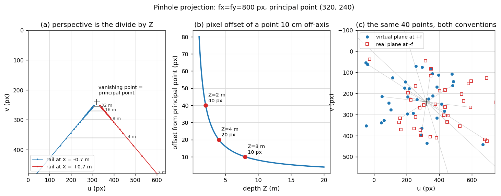
`fx = fy = 800 px`, principal point `(320, 240)`. Left: two parallel rails
converging on the principal point — the vanishing point is where the optical
axis pierces the image. Middle: the offset of a point 10 cm off-axis, falling as
`1/Z`. Right: 40 random points projected onto the virtual image plane at `+f`
and the physical sensor at `-f`; the two sets are point-reflections through the
principal point, verified to `4.6e-13 px` over 200 points.

### 2. Extrinsics and the resolution rule
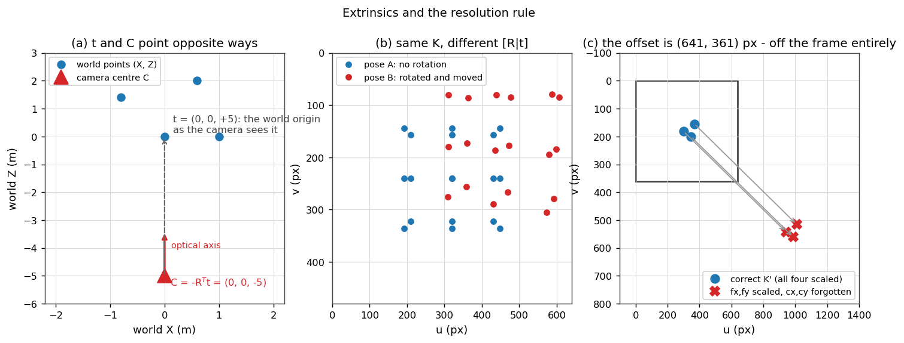
Left: the camera at `C = (0, 0, -5)` has `t = (0, 0, +5)` — same magnitude,
opposite direction. Right: scaling `fx, fy` for a 1/3 resize and leaving
`cx, cy` at full resolution offsets every point by exactly `(1-s)·cx = 641.3 px`
and `(1-s)·cy = 360.7 px`, which is wider than the entire 640-pixel image.

### 3. Lens distortion
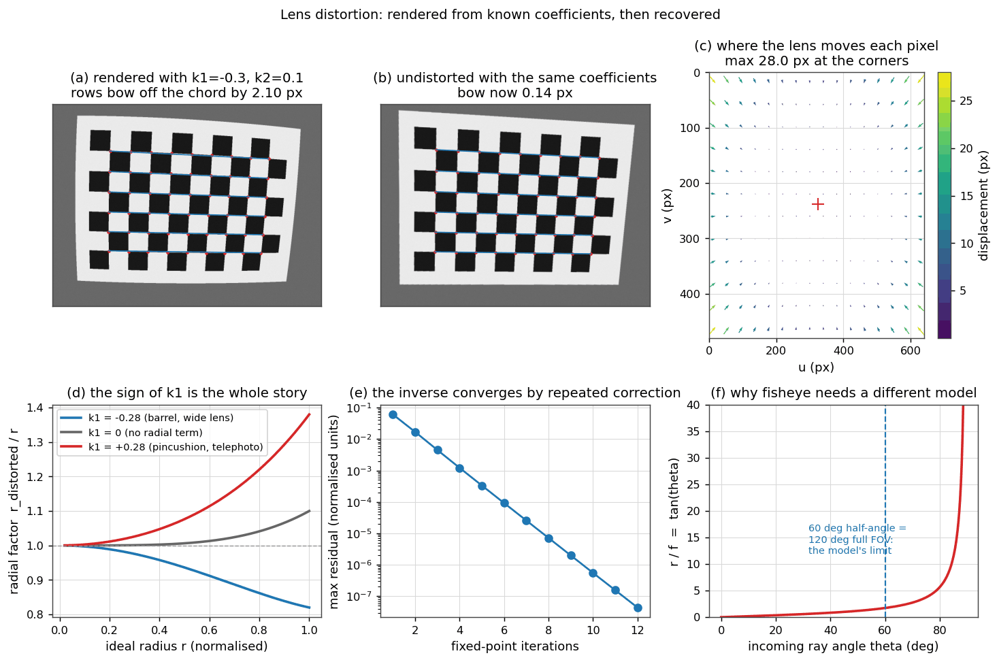
Rendered from `k1 = -0.30, k2 = 0.10, p1 = 0.0012, p2 = -0.0009`. Board rows bow
off their chord by **2.10 px** before undistortion and **0.14 px** after, a 15x
reduction; a line spanning the whole frame bows by **9.05 px**. Panel (e) is the
fixed-point inverse converging: `3.3e-4` after five iterations, `5.6e-7` after
ten, `1.7e-12` after twenty.

### 4. The calibration views
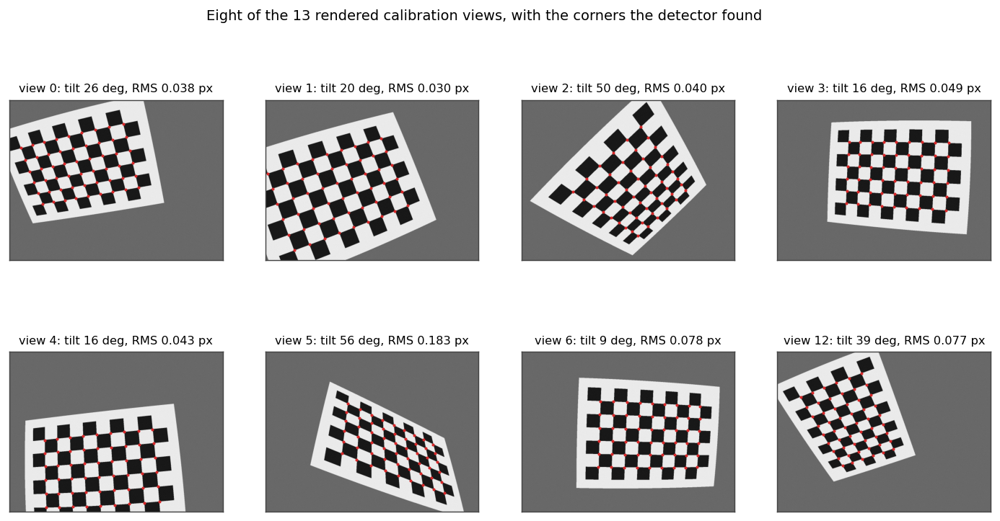
Thirteen of twenty rendered poses were detected; the seven rejected are the ones
where the board clipped the frame, which `findChessboardCornersSB` refuses.
Per-view RMS runs from 0.022 to 0.183 px.

### 5. Low error is not a correct calibration
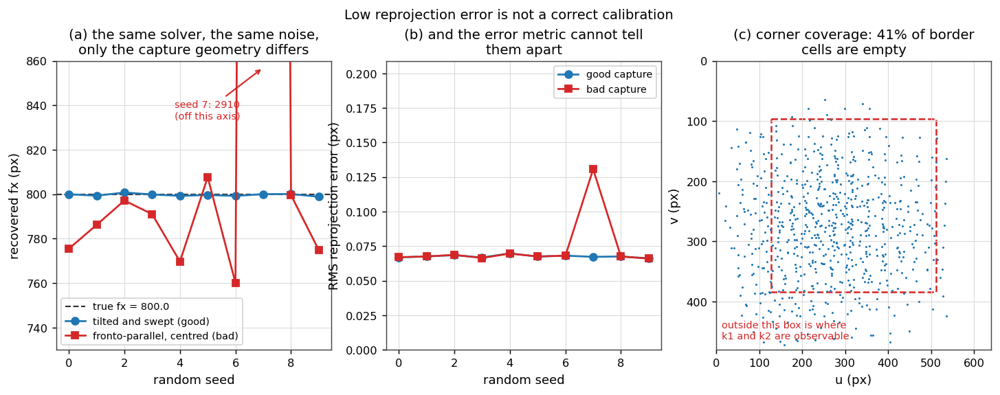
The same solver, the same ground truth, the same noise realisation, fifteen
views each. Tilted and swept: `fx` spans **798.9 to 800.8** against a true 800.0.
Fronto-parallel and centred: `fx` spans **760.1 to 2910.1**. Every reprojection
error in both columns is between **0.066 and 0.131 px**. No threshold on RMS
separates them.

### 6. Reprojection residuals
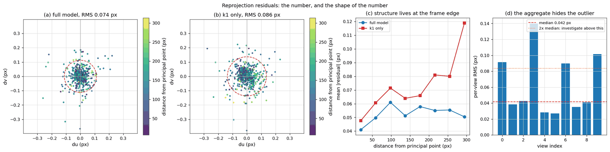
Left: the full model, RMS 0.074 px, an isotropic blob centred on zero. Middle:
the same data fitted with `k1` only, RMS 0.086 px — barely worse as a summary,
but the residuals now grow with radius (0.048 px near the centre, 0.119 px at
`r = 294 px`). Structure in a residual plot is a model that is missing a term,
and *where* the structure lives says which term.

### 7. The homography, by DLT
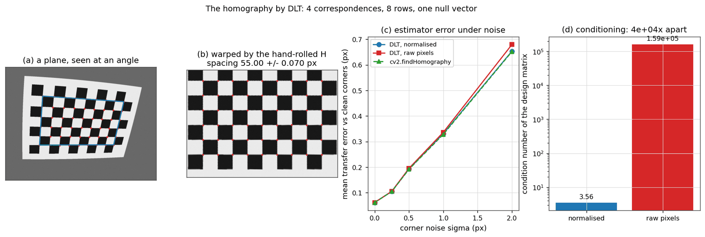
Square spacing after the warp: **55.00 ± 0.07 px** against the 55.00 px the
board geometry and output scale predict. On exact correspondences the
from-scratch DLT reproduces them to `1.9e-13 px` while `cv2.findHomography`
stops at `7.7e-06 px` — they minimise different things. Condition number of the
design matrix: **3.56 normalised, 1.59e5 raw**.

### 8. Epipolar lines
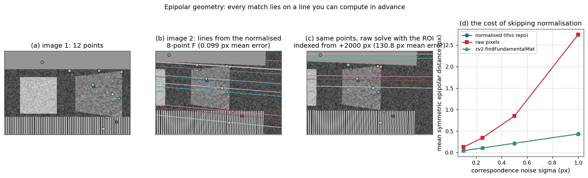
Twelve points in image 1, and the lines their matches must lie on in image 2.
The normalised eight-point solve puts them **0.099 px** from their points; the
same solve on raw pixel coordinates indexed from an origin 2000 px away misses
by **130.8 px**.

### 9. Rectification
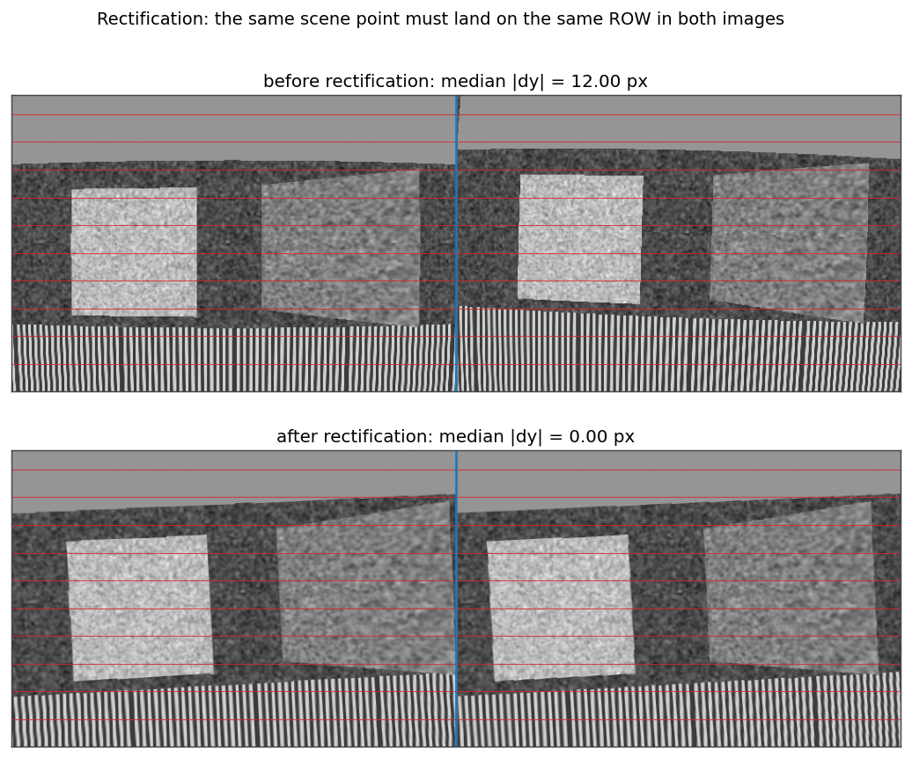
A rig with 3.3 degrees of relative rotation, a few millimetres of vertical
offset, and a real lens on both cameras. Median row disagreement over matched
ORB features: **12.00 px before, 0.00 px after**. On ground-truth
correspondences the rectified row error is `2.5e-13 px` — the warp is exact, and
the non-zero *mean* in the ORB measurement is bad matches on the striped band,
which is exactly why the acceptance criterion is stated on the median.

### 10. Disparity
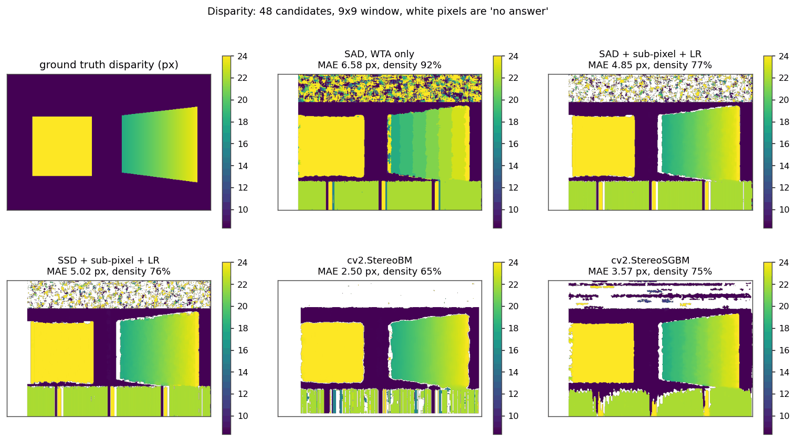
48 candidate disparities, 9×9 window, scored on matchable pixels only. White is
"no answer". The staircase across the slanted ramp in the winner-take-all panel
is integer quantisation; the sub-pixel fit removes it.

### 11. The three failure modes
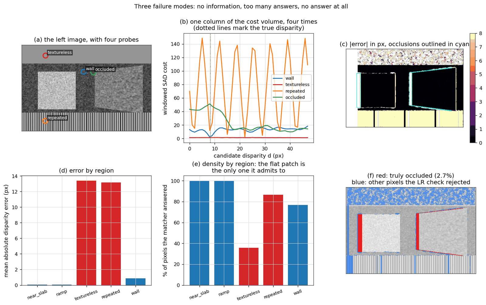
One column of the cost volume, four times. Well-textured: one sharp minimum,
cost spread 16.1, runner-up 7.1 higher. Flat grey: spread **0.38** — every
disparity costs the same and the argmin is decided by sensor noise. Stripes:
spread 146.7 with seven near-equal minima, runner-up only 2.4 away. Occluded:
the true answer is not in the volume at all.

### 12. Depth, and its error
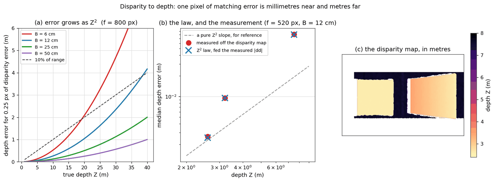
Left: `|dZ| = Z²·|dd| / (f·B)` for four baselines at 0.25 px of matching error.
Middle: the law fed the *measured* disparity error at three depth bands, against
the *measured* depth error — 0.0025 vs 0.0026 m at 2.7 m, 0.0804 vs 0.0812 m at
7.5 m.

---

## Results

Every number below is printed by the example named beside it, on
`opencv-contrib-python==4.14.0.94`, numpy 2.2.6, Python 3.10, CPU only.

### Calibration against the truth that rendered the images (`examples/04`)

Rendered at 640×480 from `fx = 800.0, fy = 802.0, cx = 325.0, cy = 238.0` and
`D = [-0.30, 0.10, 0.0012, -0.0009, 0]`; 13 views detected out of 20 rendered.

| | true | recovered | error |
|---|---|---|---|
| `fx` | 800.000 | 799.393 | **-0.076%** |
| `fy` | 802.000 | 801.385 | **-0.077%** |
| `cx` | 325.000 | 323.678 | -1.32 px |
| `cy` | 238.000 | 238.033 | +0.03 px |
| `k1` | -0.3000 | -0.29885 | +0.0012 |
| RMS reprojection error | — | 0.0720 px | — |

`k2` and `k3` come back as 0.094 and 0.013 against a true 0.100 and 0.000, and
that is expected rather than alarming: `r⁴` and `r⁶` are nearly collinear over
the radius an image spans, so the solver trades them freely. What has to match
is the curve, and it does — the true and recovered undistortion disagree by at
most **0.332 px** anywhere in the frame (mean 0.071 px).

### The eight-point algorithm, normalised and not (`examples/07`)

Mean symmetric epipolar distance in pixels, scored against clean
correspondences, 480×320 image, 60 points, 20 trials per row:

| correspondence noise | normalised | raw pixels | `cv2.findFundamentalMat` |
|---|---|---|---|
| 0.00 px | 0.0000 | 0.0000 | 0.0000 |
| 0.10 px | 0.0429 | 0.1269 | 0.0429 |
| 0.25 px | 0.1074 | 0.3445 | 0.1074 |
| 0.50 px | 0.2153 | 0.8491 | 0.2153 |
| 1.00 px | 0.4321 | 2.7387 | 0.4321 |

Our normalised solve and OpenCV's agree to four decimal places, because
`findFundamentalMat` normalises internally and does not mention it. The raw
solve's penalty is not fixed — it depends on how far the coordinates sit from
the origin, which is a bookkeeping choice and not geometry:

| offset added to every coordinate | normalised | raw pixels | ratio |
|---|---|---|---|
| 0 px | 0.2153 | 0.8491 | 4x |
| 500 px | 0.2153 | 13.561 | 63x |
| 2000 px | 0.2153 | 85.560 | 397x |
| 8000 px | 0.2153 | 617.645 | **2869x** |

The normalised column does not move by a digit.

### Stereo matching (`examples/08`, 480×320, 48 disparities, 9×9 window)

Scored on matchable pixels — neither occluded nor off the edge of the right
image — against exact ground truth.

| matcher | density | MAE | RMSE | bad > 1 px | time |
|---|---|---|---|---|---|
| SAD, winner-take-all | 91.7% | 6.585 px | 11.276 | 42.7% | 0.16 s |
| SAD + sub-pixel | 91.7% | 6.490 px | 11.256 | 42.7% | 0.07 s |
| SAD + sub-pixel + left-right | 77.2% | 4.848 px | 9.023 | 33.2% | 0.14 s |
| SSD + sub-pixel + left-right | 76.2% | 5.021 px | 9.202 | 34.1% | 0.11 s |
| `cv2.StereoBM` | 64.9% | 2.499 px | 5.840 | 18.5% | 0.01 s |
| `cv2.StereoSGBM` | 75.3% | 3.566 px | 6.954 | 28.1% | 0.03 s |

The timings jitter by roughly 2x between runs on the same machine: the
sub-pixel stage allocates and argmins a second 29 MB volume, so it is at the
mercy of memory bandwidth and whatever else is running. Two seconds or eight
would both be normal; two minutes would mean Python loops instead of NumPy.

Those whole-image numbers are dominated by two regions deliberately built to
break a matcher. Scored on the textured surfaces alone — the three where the
images actually contain an answer:

| matcher | density | MAE | bad > 1 px |
|---|---|---|---|
| SAD, winner-take-all | 91.8% | 0.748 px | 3.3% |
| SAD + sub-pixel | 91.8% | 0.606 px | 3.3% |
| SAD + sub-pixel + left-right | 90.1% | **0.354 px** | 2.0% |
| SSD + sub-pixel + left-right | 89.4% | 0.558 px | 3.7% |
| `cv2.StereoBM` | 88.4% | 0.160 px | 0.7% |
| `cv2.StereoSGBM` | 91.2% | 0.298 px | 1.3% |

That is the honest comparison, and it tells a different story from the table
above: where the data contains the information, this matcher lands within
**0.056 px** of `StereoSGBM`. Almost the whole of the whole-image gap is about
what each of them does where the information is *not* there. By region
(`examples/09`):

| region | true disparity | density | MAE | bad > 1 px |
|---|---|---|---|---|
| near slab (2.6 m) | 24.00 px | 99.6% | **0.045 px** | 0.2% |
| slanted ramp | 20.99 px | 100.0% | **0.077 px** | 0.2% |
| back wall (7.5 m) | 8.32 px | 76.8% | 0.874 px | 5.2% |
| flat grey patch | 8.32 px | 35.9% | **13.379 px** | 82.0% |
| stripe pattern | 8.32 px | 86.6% | **13.154 px** | 95.4% |

Read the last two rows against each other. The textureless patch is wrong *and
mostly refuses to answer* (36% density). The repeated pattern answers for 87% of
its pixels and is wrong about 95% of them. **Confident nonsense is worse than an
admitted gap**, and the two need different fixes.

The left-right check rejects **68.8%** of genuinely occluded pixels against
**18.0%** of everything else, and it is the only mechanism here that can detect
"this pixel is not in the other image".

### Depth (`examples/10`)

`f = 800 px`, `B = 12 cm`, so `f·B = 96` metre-pixels:

| disparity | depth | one pixel either way | spread |
|---|---|---|---|
| 30 px | 3.200 m | 3.097 – 3.310 m | 0.214 m |
| 12 px | 8.000 m | 7.385 – 8.727 m | 1.343 m |
| 4 px | 24.000 m | 19.200 – 32.000 m | **12.800 m** |

`12.800 / 0.214 = 60`, against `(24/3.2)² = 56` predicted by the square law —
they agree, and the small gap is because one pixel is not an infinitesimal.
Note that the interval is asymmetric: the far side runs away faster than the
near side approaches, so a symmetric `±` at range understates the risk on the
side that matters.

Triangulation of a point at 5 m from two views with 0.5 px of observation noise
and nothing else wrong: the two back-projected rays miss each other by
**6.51 mm**, and over 400 noise draws the recovered point's spread is
`σx = 2.31 mm`, `σy = 2.11 mm`, `σz = 21.44 mm` — an ellipsoid **9x longer along
the viewing ray** than across it, never a sphere.

---

## Why it is built this way

### Why synthetic, and what it costs

A calibration demo built on photographs can report one number: the reprojection
error. It cannot report whether `fx` is right, because nobody knows what `fx`
is. That matters here more than usual, because the single most important lesson
in this repository is that **reprojection error and correctness are different
things** — and demonstrating that requires knowing the answer in advance.

So the images are rendered from intrinsics, distortion coefficients, poses and
depths that are variables in a script, then recovered through exactly the path a
real image would take: render → detect corners → `cv2.calibrateCamera` →
compare. The checkerboard renderer is a *backward* ray tracer (pixel → undistort
→ ray → intersect the board plane) so the distortion in the rendered image is
the exact inverse of the undistortion the calibration later applies; recovering
`D` is a real round trip and not a tautology.

What this cannot show, and the README should not pretend otherwise: sensor noise
with a realistic model, motion blur, rolling shutter, printing error in the
board, chromatic aberration, or the ten-minute argument with a webcam that will
not turn its autofocus off. A calibration that works here is a **necessary**
condition for one that works on a rig, not a sufficient one.

### Derive, then call, then compare

Every algorithm in `src/geo/` that OpenCV also provides is implemented by hand
first and checked against the library numerically, in a test:

| by hand | library | agreement |
|---|---|---|
| `distortion.project_distorted` | `cv2.projectPoints` | `5.7e-14 px` |
| `distortion.undistort_normalized` | `cv2.undistortPoints` | `< 5e-3 px` (their tolerance, not ours) |
| `homography.homography_dlt` | `cv2.findHomography` | `< 1e-4` on clean points |
| `epipolar.eight_point` | `cv2.findFundamentalMat` | `< 1e-6` on clean points |
| `depth.triangulate_dlt` | `cv2.triangulatePoints` | `1.7e-16 m` |
| `depth.reproject_disparity` | `cv2.reprojectImageTo3D` | `< 1e-5 m` (float32 on their side) |

The comparison is the lesson. Knowing that your own eight-point solve lands on
top of OpenCV's tells you the library is not doing anything mysterious — and
knowing *where* they diverge (the DLT minimises algebraic error; OpenCV then
refines on reprojection error) tells you which one to reach for.

Production code should call the library: it is faster, it has RANSAC wrapped
around it, and it has been debugged by more people. The hand-rolled versions
exist so that when the library's answer is wrong you can tell.

### Vectorised cost volume, not four nested loops

`stereo.cost_volume` inverts the obvious loop order. Instead of "for each pixel,
try each disparity", it does "for each disparity, score every pixel at once" —
48 whole-image operations instead of 7.4 million interpreted ones. The scene here
matches in 0.07–0.16 s; the naive form takes minutes, which is the difference
between iterating on the algorithm and abandoning it.

The cost is that the volume is materialised in memory: `D × H × W` float32,
which is 29 MB at this size and 118 MB at 741×500 with 80 disparities. A
production matcher streams it. A teaching one should not, because the whole
point is that the cost volume is an object you can slice, plot and reason about
— it is the same `D × H × W` array that sits at the centre of every learned
stereo network, with SAD replaced by a feature correlation.

### NaN for "no answer", never zero

Invalid disparities are `NaN`. Zero is a legal disparity meaning "infinitely far
away", so a map that encodes ignorance as zero has silently placed a horizon
behind every occlusion, and every mean taken of it afterwards is wrong. The
`score_disparity` helper reports **density alongside error** for the same
reason: a matcher that answers 40% of the image can post a beautiful mean, and
one that answers everywhere posts a worse one while being more useful. Quoting
either alone is misleading.

### Two scenes, not one

`render_stereo_pair` builds a pair that is rectified *by construction* —
identical intrinsics, identical orientation, pure baseline translation. That
keeps the block-matching lesson free of rectification error: when the matcher is
wrong in that scene, it is the matcher. `render_view` then builds a genuinely
misaligned, distorted pair for `examples/08`, where `cv2.stereoRectify` has real
work to do and the row-alignment metric has something to measure. Mixing the two
would have made both lessons weaker.

### The alternatives that were considered and rejected

- **A real dataset (Middlebury, KITTI).** Rejected because it needs a download
  at run time, and because ground-truth *intrinsics* are still not available —
  you would be back to trusting a reprojection error. Middlebury's published rig
  parameters do appear in `examples/10`, as the numbers behind the `doffs`
  demonstration, because that is a case where published constants are exactly
  what is needed.
- **ChArUco instead of a chessboard.** A ChArUco board would fix the real
  weakness of this capture — 41% of the outer border cells hold no corner,
  because a full-board detector loses the board as soon as it clips the frame.
  It is named in `examples/04` where the tension shows up. It was not adopted
  because the ArUco API moved between OpenCV 4 and 5 and the extra machinery
  would sit between the reader and the geometry.
- **RANSAC around the eight-point solve.** Deliberately absent. The
  correspondences here come from the renderer's depth map and are exact, so
  RANSAC would have nothing to reject and would hide the conditioning lesson
  behind a robust wrapper. Real correspondences need it; that belongs in the
  repository about feature matching, and in `stereo-visual-slam`.
- **Semi-global aggregation in the block matcher.** Not implemented, and the
  README says so rather than quietly comparing against a weaker baseline. It is
  what closes the remaining 0.056 px on textured surfaces and most of the much
  larger gap on the textureless patch, where a confident neighbour can pull an
  ambiguous pixel to the right answer and a per-pixel argmin cannot.

---

## Honest limitations

- **The scenes are synthetic.** See above. No sensor noise model, no blur, no
  rolling shutter, no board printing error.
- **The matcher does not beat `StereoSGBM`** and is not meant to. It implements
  the part of SGBM that is not the smoothness term, and it is `StereoBM` — the
  library's own SAD matcher, with post-filters this one does not have — that
  wins the textured-surface comparison outright.
- **Corner coverage in the calibration capture is thin at the frame edges**
  (41% of border cells empty), which is why `k2` and `k3` are recovered less
  well than `k1`. That is a property of full-board chessboard capture and is
  reported rather than hidden.
- **The principal point is the weakest of the four intrinsics** — recovered here
  to 1.3 px, an order of magnitude worse in relative terms than the focal
  lengths. That is expected: `cx` and `cy` are constrained mainly by the frame
  edges, which is exactly where the coverage is thin.
- **No RANSAC, no outliers.** Every correspondence in the two-view examples is
  exact by construction. Real matching produces gross outliers and needs a
  robust estimator.
- **Nothing here is real-time.** The block matcher is NumPy on a CPU. A rig that
  has to run at 30 fps uses `StereoSGBM`, a GPU, or an FPGA.
- **The chessboard detector's 180-degree ambiguity is absorbed, not resolved.**
  A 9×6 pattern looks identical upside down, so the detector may return the
  corners reversed; the calibration folds that into the board pose. Identified
  corners (ChArUco) are the real fix.

---

## Repository layout

```
src/geo/
  pinhole.py      K, [R|t], the perspective divide, the resolution rule
  distortion.py   Brown-Conrady forward, the iterative inverse, remap tables
  synthetic.py    the renderers: checkerboards and a textured stereo scene
  homography.py   Hartley normalisation and the DLT
  calibrate.py    calibrateCamera plus the diagnostics it does not give you
  epipolar.py     skew, E, F, the eight-point algorithm, cheirality
  stereo.py       rectification, cost volume, WTA, sub-pixel, left-right check
  depth.py        Z = fB/d, the error law, Q, triangulation by DLT
examples/         01..10, each runnable alone, each writing a figure
tests/            88 tests, offline, deterministic
docs/
  WALKTHROUGH.md  the long-form explanation, stage by stage, quoting the code
  DECISIONS.md    the architectural choices and what each one costs
  figures/        the twelve committed figures
```

## Running it

```bash
python3 -m pip install -r requirements.txt

python3 -m pytest -q                                  # 88 tests, ~14 s
python3 examples/04_calibrate_from_synthetic_views.py # ~21 s, the slowest one
python3 examples/05_reprojection_error.py             # ~15 s
```

Both of those spend their time rendering checkerboards; every other example
finishes in one to three seconds. All of them write into
`docs/figures/` and print the numbers quoted in this README, so a claim you
doubt can be re-measured by running the file that made it.

## Related work

This is the fourth repository in a four-part teaching series, and the most
advanced:

1. [**cv01-pixels-to-edges**](https://github.com/Pratyush150/cv01-pixels-to-edges)
   — pixels, dtypes, colour spaces, the silent `uint8` wrap, convolution by hand,
   separable kernels, edges and thresholds.
2. [**cv02-features-to-panorama**](https://github.com/Pratyush150/cv02-features-to-panorama)
   — corners, descriptors, matching, RANSAC, and the five ways matching lies.
3. [**cv03-backprop-to-cnn**](https://github.com/Pratyush150/cv03-backprop-to-cnn)
   — backpropagation derived and gradient-checked, then a CNN trained in NumPy.
4. **This one** — geometry: calibration, two views, stereo, depth.

Each assumes the ones before it. This one assumes you are comfortable with
arrays, convolution, and keypoint correspondences, and it never re-explains them.

**Where this goes next:** the portfolio's `stereo-visual-slam` repository, which
measures **1.256% translation error** on a KITTI sequence. Everything in that
system rests on what is derived here — its depth comes from `Z = fB/d` on a
rectified pair, its pose estimates come from the epipolar geometry and PnP, its
bundle adjustment minimises exactly the reprojection error defined in
`examples/05`, and the `Z²` error law in `examples/10` is why it weights near
landmarks over far ones. This repository is the geometry underneath it, worked
out slowly and checked at every step.

## License

MIT — see [LICENSE](LICENSE).
